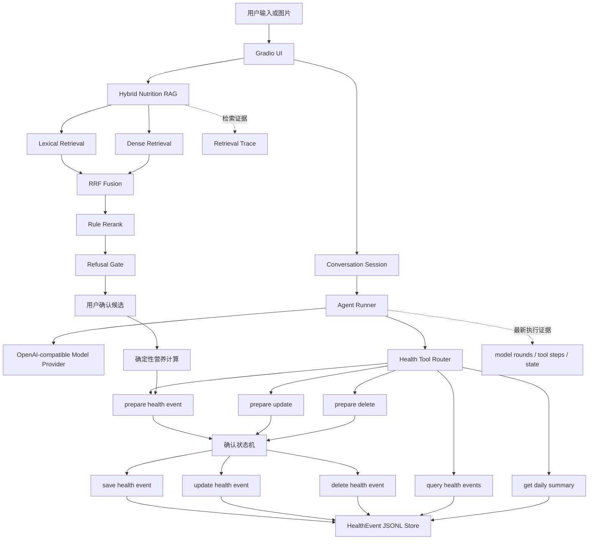

# 个人健康管理助理 Agent

一个面向 AI 应用工程学习和求职作品集的个人健康管理助手。

项目通过 Gradio 提供对话、饮食确认、健康事件管理和开发者证据页面，结合 OpenAI-compatible LLM、Hybrid RAG、确定性营养计算、工具调用、确认状态机和 JSONL 存储，实现可运行、可解释、可评测、可拒答、可追溯的健康记录流程。

> 项目需求参考：[个人健康管理助理 Agent PRD](https://ruiyuan-ai-career-map.vercel.app/food-health-assistant-prd.html)

> 本项目用于学习和个人生活记录演示，不提供医疗诊断、治疗、用药或紧急医疗服务。

## 当前进度

截至 2026-08-30：

- 8.26：完成图片输入、人工食物候选、营养计算、确认和饮食保存主链；
- 8.27：完成食物数据准备、Hybrid RAG、拒答门控和固定检索评测；
- 8.28：完成饮食、饮水、体重、运动四类健康事件的保存、查询、修改和删除；
- 8.29：完成健康时间线、每日汇总、多轮补参、脱敏 Agent Trace 和失败 E2E。

### 功能状态

| 能力 | 状态 | 说明 |
| --- | --- | --- |
| 单张食物图片输入 | 已完成 | 图片作为输入入口，识别失败时仍可人工填写 |
| 手动食物候选 | 已完成 | 支持标准名、别名和自然语言描述 |
| Lexical Retrieval | 已完成 | 标准名、别名、包含和模糊匹配 |
| Hybrid RAG | 已完成 | Dense Retrieval、RRF Fusion 和 Rule Rerank |
| 检索拒答门控 | 已完成 | 低置信度、歧义和领域外查询不会进入营养计算 |
| 用户确认食物候选 | 已完成 | 不会静默选择检索第一名 |
| 确定性营养计算 | 已完成 | 营养数值来自结构化数据行和用户份量 |
| 四类 HealthEvent 模型 | 已完成 | `meal`、`water`、`weight`、`exercise` |
| 四类事件保存 | 已完成 | 参数校验、草稿、确认令牌和幂等写入 |
| 四类事件查询 | 已完成 | 支持按用户、类型、日期和排序条件查询 |
| 四类事件修改 | 已完成 | 先展示前后对比，确认后更新 |
| 四类事件删除 | 已完成 | 先展示目标，确认后删除 |
| LLM Agent Loop | 已完成 | 有限模型轮次、工具白名单和 Tool Result 回传 |
| OpenAI-compatible Provider | 已完成 | 支持配置 DeepSeek 等兼容 Chat Completions Tools 的 Provider |
| pending task | 已完成 | 缺少必填参数时暂存任务并在下一轮合并参数 |
| 健康时间线 | 已完成 | 按用户、日期和类型读取已保存事件 |
| 每日汇总 | 已完成 | 确定性汇总只读取 committed events |
| Agent 执行证据 | 已完成 | 页面展示脱敏 `model_rounds`、`tool_steps`、`state` 和 pending 状态 |
| AgentTrace JSONL | 已完成 | 发送、确认和取消会脱敏写入 `data/agent_traces.jsonl` |
| 失败流程 E2E | 已完成 | 9 条 E2E 覆盖成功、缺参、取消、非法参数、白名单和 Trace 失败 |
| 图片食物识别 | 未完成 | 尚未接入真实 YOLO 权重 |
| GitHub Actions CI | 未完成 | 最终验收前补充 |
| P1 目标、记忆和 check-in | 未完成 | 不属于当前 P0 阶段 |

## 8.28 完成结果

8.28 阶段目标已经完成：

> 饮食、饮水、体重、运动四类健康事件均支持保存、查询、修改和删除。

四类事件共用统一的 `HealthEvent` 外层结构：

```text
HealthEvent
├── schema_version
├── event_id
├── user_id
├── event_type
├── occurred_at
├── payload
├── source_refs
├── input_source
├── created_at
└── updated_at
```

不同事件使用不同的 `payload`：

| 事件类型 | 必填字段 | 可选字段 |
| --- | --- | --- |
| `meal` | 食物、份量、营养估算、来源 | 候选来源 |
| `water` | `amount_ml` | 饮品名称、备注 |
| `weight` | `weight_kg` | 备注 |
| `exercise` | `activity_type`、`duration_minutes` | 距离、强度、备注 |

### CRUD 安全边界

保存、修改和删除都遵守：

```text
用户请求
→ Agent 选择白名单工具
→ 参数校验
→ 生成草稿
→ 展示待执行内容
→ 等待用户确认
→ 执行写操作
→ 幂等校验
→ 重新读取持久化结果
```

模型只能提出操作，不能绕过确认直接写入数据。

## 8.29 完成结果

8.29 阶段目标已完成：

> 完成健康时间线、每日确定性汇总、多轮缺参追问、脱敏 Agent Trace，以及失败不落数据的 E2E 验收。

验收结果：

- 健康时间线只读取已保存事件，支持日期和事件类型过滤；
- 每日汇总对饮食、饮水、体重和运动执行确定性聚合；
- `pending_task` 保存已知参数，下一轮补充缺失参数；
- Agent 发送、确认和取消都会写入脱敏 Trace；
- Agent Trace 不保存原始对话、健康参数值或确认令牌；
- 模型不能仅通过文本假装生成草稿，明确健康意图必须调用工具；
- 非法参数、未知工具、用户取消和 Trace 写入失败均有固定测试；
- E2E 测试共 9 条，满足“至少 8 条完整流程”要求。

## 核心设计原则

### 1. RAG 只负责找食物

Hybrid RAG 负责从固定食物数据库中检索候选，不负责生成营养事实。

热量、蛋白质、脂肪和碳水等数值必须来自结构化食物记录。

### 2. 营养计算必须确定

计算公式固定为：

```text
每 100g 营养值 × 用户填写克重 ÷ 100
```

同一食物、同一份量和同一数据版本必须得到相同结果。

LLM 不得补写、改写或猜测营养数值。

### 3. 候选必须由用户确认

系统不会因为某个食物排在检索第一名就自动保存。

用户必须检查并选择候选，才能进入营养计算和保存流程。

### 4. 证据不足时拒答

系统在检索后执行拒答门控：

- 标准名精确匹配可以放行；
- 人工别名精确匹配可以放行；
- Lexical 和 Dense 共同命中可以放行；
- 类别与语义证据不足时拒绝；
- 第一名与竞争候选过于接近时要求用户选择；
- 领域外或低置信度查询返回 `not_found`。

拒答结果不会进入营养计算：

```text
status = not_found
candidates = []
auto_select_allowed = false
```

### 5. 写操作必须确认

以下操作不得静默执行：

- 保存健康事件；
- 修改健康事件；
- 删除健康事件。

确认前只生成草稿，不修改 JSONL。

### 6. 重复操作必须幂等

保存、修改和删除都使用幂等键。

使用相同确认信息重复提交时，只返回已经存在的最终结果，不重复创建或修改数据。

## 系统架构



## Agent 执行链路

一次 Agent 对话可能经历：

```text
用户输入
→ 构造最小 messages
→ 模型返回文本或 tool call
→ 工具白名单检查
→ 工具参数校验与归一化
→ 执行只读工具或生成写操作草稿
→ Tool Result 返回模型
→ 模型继续、追问或结束
```

Agent 在以下情况终止当前轮次：

- 模型返回最终文本；
- 缺少参数，需要用户补充；
- 已生成草稿，等待用户确认；
- 用户取消；
- 工具参数无效；
- 工具执行失败；
- 达到最大模型轮数。

### Agent 状态

主要状态包括：

```text
idle
running
awaiting_clarification
awaiting_confirmation
completed
failed
cancelled
```

### 模型可见工具

模型只能调用静态白名单中的工具：

```text
prepare_health_event
query_health_events
get_daily_health_summary
prepare_update_health_event
prepare_delete_health_event
```

模型不能直接调用真正的写操作。

用户确认后，程序才会执行：

```text
save_health_event
update_health_event
delete_health_event
```

## Hybrid RAG

### 在线检索流程

```text
用户查询
→ 文本归一化
→ 四阶段词法召回
→ Dense 向量召回
→ RRF 排名融合
→ 类别约束和规则重排
→ 弱单字包含过滤
→ 拒答门控
→ 返回候选
→ 用户确认
→ 读取结构化营养事实
```

### 词法召回阶段

1. 标准名称完全匹配；
2. 人工别名完全匹配；
3. 双向包含匹配；
4. 字符级模糊匹配。

### Dense Retrieval

当前 Embedding 模型：

```text
BAAI/bge-small-zh-v1.5
```

每条食物会转换成一条检索文档，包括：

- 标准名称；
- 人工别名；
- 食物类别；
- 人工语义提示。

文档向量保存在本地 NumPy 索引中。

### RRF Fusion

Reciprocal Rank Fusion 使用 Lexical 和 Dense 两个通道的排名进行融合，不直接混合量纲不同的原始分数。

### Rule Rerank

融合后继续执行确定性规则：

- 标准名和别名精确匹配优先；
- 查询明确包含类别时，同类别候选优先；
- 单字食物名不能因为出现在无关长描述中形成强匹配。

例如：

```text
橙色的根茎类蔬菜
```

不能因为“橙色”包含“橙”，就把水果“橙”排在“胡萝卜”前面。

## RAG 评测结果

固定评测集包含 20 条查询，覆盖：

- 标准名称；
- 人工别名；
- 口语名称；
- 复合菜；
- 相似食物；
- 错别字；
- 不存在食物；
- 领域外拒答。

当前 `docs/eval_hybrid.json` 结果：

| 指标 | 当前结果 | 门槛 |
| --- | ---: | ---: |
| Recall@3 | 0.9474 | ≥ 0.85 |
| Top-1 Accuracy | 0.9474 | 记录项 |
| Rejection Accuracy | 1.0 | = 1.0 |
| Dense 降级次数 | 0 | = 0 |
| 报告状态 | `passed: true` | `true` |

评测报告是检索指标的事实来源。

修改以下任一内容后必须重新构建索引并生成评测报告：

- 食物数据；
- 人工别名；
- 语义提示；
- Embedding 模型；
- 查询指令；
- 检索规则；
- 拒答门控阈值。

## 技术栈

- Python 3.11+
- Gradio 6
- Pydantic v2
- OpenAI Python SDK
- python-dotenv
- Pillow
- NumPy
- Sentence Transformers
- BAAI/bge-small-zh-v1.5
- pytest
- JSON Lines

所有直接依赖均固定在 `requirements.txt` 中。

## 目录结构

```text
health-assistant-agent/
├── app.py
├── requirements.txt
├── .env.example
├── .gitignore
├── README.md
├── LICENSE
├── data/
│   ├── aliases.json
│   ├── retrieval_hints.json
│   ├── samples/
│   │   └── foods_sample.json
│   └── index/
│       ├── food_documents.json
│       ├── food_embeddings.npy
│       └── index_manifest.json
├── docs/
│   ├── DATA_SOURCES.md
│   ├── DECISIONS.md
│   ├── EVALUATION.md
│   ├── RAG.md
│   ├── eval_hybrid.json
│   ├── eval_lexical.json
│   └── scope.md
├── scripts/
│   ├── prepare_food_data.py
│   ├── build_food_index.py
│   └── run_eval.py
├── src/
│   ├── agent/
│   │   ├── models.py
│   │   ├── openai_model.py
│   │   ├── runner.py
│   │   └── tool_router.py
│   ├── health/
│   │   ├── models.py
│   │   ├── migrations.py
│   │   └── daily_summary.py
│   ├── nutrition/
│   │   ├── calculator.py
│   │   ├── repository.py
│   │   ├── retrieval_document.py
│   │   ├── dense_retriever.py
│   │   ├── hybrid_retriever.py
│   │   ├── retrieval_gate.py
│   │   ├── retrieval_trace.py
│   │   ├── evaluation.py
│   │   └── text_normalize.py
│   ├── storage/
│   │   ├── jsonl_store.py
│   │   └── trace_store.py
│   ├── tools/
│   │   ├── confirmation.py
│   │   ├── prepare_health_event.py
│   │   ├── save_health_event.py
│   │   ├── query_health_events.py
│   │   ├── prepare_health_event_mutation.py
│   │   ├── update_health_event.py
│   │   ├── delete_health_event.py
│   │   ├── get_daily_health_summary.py
│   │   └── retrieve_nutrition_candidates.py
│   └── ui/
│       ├── app.py
│       └── image_input.py
└── tests/
    ├── e2e/
    │   └── test_manual_meal_flow.py
    ├── eval/
    │   ├── nutrition_retrieval.jsonl
    │   └── test_retrieval_eval.py
    ├── fixtures/
    │   └── meal.png
    └── unit/
        ├── test_agent_tool_router_normalization.py
        ├── test_daily_summary.py
        ├── test_health_agent_runner.py
        ├── test_health_event_models.py
        ├── test_health_event_mutation_tools.py
        ├── test_hybrid_retrieval.py
        ├── test_jsonl_store_crud.py
        ├── test_openai_agent_model.py
        ├── test_retrieval.py
        └── test_retrieval_eval.py
```

## 十分钟快速启动

### 1. 克隆项目

```bash
git clone https://github.com/Woresy/health-assistant-agent.git
cd health-assistant-agent
```

### 2. 创建 Python 3.11 虚拟环境

```bash
python3.11 -m venv .venv
source .venv/bin/activate
```

确认版本：

```bash
python --version
```

预期为 Python 3.11 或更高版本。

### 3. 安装依赖

```bash
python -m ensurepip --upgrade
python -m pip install --upgrade pip
python -m pip install -r requirements.txt
```

请始终使用：

```bash
python -m pip
```

避免混用系统环境中的裸 `pip`。

### 4. 创建本地环境配置

```bash
cp .env.example .env
```

默认配置为：

```dotenv
AGENT_PROVIDER_MODE=disabled
RAG_MODE=lexical
```

在没有 LLM API Key、没有 Dense 模型网络访问的情况下，仍可以启动页面并使用：

- 人工饮食候选；
- Lexical 食物检索；
- 确定性营养计算；
- 健康时间线；
- 每日汇总。

### 5. 启动应用

```bash
python app.py
```

浏览器访问：

```text
http://127.0.0.1:7860
```

## 配置真实 Agent Provider

项目支持提供 Chat Completions 和 Tool Calling 的 OpenAI-compatible Provider。

编辑本地 `.env`：

```dotenv
APP_HOST=127.0.0.1
APP_PORT=7860
APP_TIMEZONE=Asia/Shanghai

RAG_MODE=lexical
FOOD_DATA_PATH=
FOOD_INDEX_DIR=data/index

AGENT_PROVIDER_MODE=openai_compatible
AGENT_API_KEY=<你的API-Key>
AGENT_BASE_URL=<Provider的OpenAI-compatible-Base-URL>
AGENT_MODEL=<支持Tool-Calling的模型名称>

AGENT_REQUEST_TIMEOUT=60
AGENT_MAX_RETRIES=2
AGENT_MAX_TOKENS=1024

HEALTH_CONFIRMATION_SECRET=<至少32位的本地随机字符串>
```

DeepSeek 示例：

```dotenv
AGENT_PROVIDER_MODE=openai_compatible
AGENT_API_KEY=<你的DeepSeek-API-Key>
AGENT_BASE_URL=https://api.deepseek.com
AGENT_MODEL=deepseek-v4-flash
```

注意：

- 不要在配置值外保留 `<` 和 `>`；
- 不要把真实 API Key 写入 `.env.example`；
- 不要提交 `.env`；
- Provider 必须支持 Chat Completions 和 Tool Calling；
- Provider 超时、认证失败或参数异常时，页面应明确显示错误，不能伪造成功。

## 配置 Hybrid RAG

仓库中已有示例索引时，可以直接设置：

```dotenv
RAG_MODE=hybrid
FOOD_INDEX_DIR=data/index
```

如果需要重新构建索引：

```bash
python scripts/build_food_index.py \
  --data data/samples/foods_sample.json \
  --hints data/retrieval_hints.json \
  --index-dir data/index
```

然后启动：

```bash
RAG_MODE=hybrid python app.py
```

第一次加载 Dense 模型可能需要下载：

```text
BAAI/bge-small-zh-v1.5
```

模型缓存后可以继续在本地使用。

## 页面说明

应用包含以下页面：

### 今天

展示：

- 当前日期；
- 已保存健康事件；
- 饮水量；
- 运动时长；
- 最近一次体重；
- 饮食营养估算汇总；
- 数据为空或读取失败提示。

### 对话

用于：

- 保存饮水、体重和运动；
- 查询健康事件；
- 生成修改草稿；
- 生成删除草稿；
- 确认或取消当前操作；
- 查看 Agent 状态。

### 健康时间线

支持：

- 选择日期；
- 选择事件类型；
- 重新读取 JSONL；
- 按发生时间展示事件；
- 查看 `event_id`，用于精确修改和删除。

### 饮食确认

用于：

- 上传食物图片；
- 手动填写食物名称或描述；
- 检索食物候选；
- 用户确认候选；
- 输入食物克重；
- 确定性计算营养值；
- 确认保存饮食事件。

### 开发者证据

展示最近一次：

- `tool_steps`；
- Agent `state`；
- pending task；
- pending confirmation；
- Retrieval Trace。

确认令牌会被脱敏。

### 隐私与数据

说明：

- 数据保存位置；
- API Key 边界；
- 图片处理方式；
- Session 生命周期；
- 健康安全限制。

## 四类健康事件操作示例

### 饮水保存

输入：

```text
记录喝水500毫升，时间是现在
```

预期：

```text
prepare_health_event
→ awaiting_confirmation
→ 用户确认
→ save_health_event
```

### 体重保存

输入：

```text
记录体重65.2公斤，时间是现在
```

### 运动保存

输入：

```text
记录跑步30分钟，距离5公里，中等强度，时间是现在
```

### 查询记录

输入：

```text
查询我今天的饮水记录
```

需要精确修改或删除时，可以要求返回：

```text
请告诉我最新一条体重记录的 event_id
```

### 修改体重

输入：

```text
把事件 <event_id> 的体重修改为64.8公斤，请先生成修改草稿
```

预期：

```text
prepare_update_health_event
→ awaiting_confirmation
→ 用户确认
→ update_health_event
```

### 修改运动

输入：

```text
把事件 <event_id> 的运动时长修改为40分钟，其他内容保持不变
```

### 删除事件

输入：

```text
删除事件 <event_id>，请先展示待删除内容
```

预期：

```text
prepare_delete_health_event
→ awaiting_confirmation
→ 用户确认
→ delete_health_event
```

## 人工饮食主链

1. 打开“饮食确认”。
2. 上传 JPG、JPEG 或 PNG 图片。
3. 手动填写食物名称或食物描述。
4. 填写可食部分克重。
5. 点击“查找候选”。
6. 检查候选名称、类别、匹配方式、分数和来源。
7. 从候选列表中明确选择食物。
8. 点击“计算营养估算”。
9. 检查份量、营养值、来源和计算假设。
10. 点击“确认保存饮食”。
11. 在“今天”或“健康时间线”重新读取记录。

即使没有 YOLO，人工饮食主链仍然可以运行。

## 手动验证 Hybrid RAG

### 标准名称

查询：

```text
番茄
```

预期第一名：

```text
番茄
```

### 人工别名

查询：

```text
西红柿
```

预期候选包含：

```text
番茄
```

### 描述性查询

查询：

```text
橙色的根茎类蔬菜
```

预期第一名：

```text
胡萝卜
```

### 领域外拒答

查询：

```text
蓝色跑车
```

预期：

```text
status = not_found
candidates = []
```

### 低置信度拒答

查询：

```text
一种没有具体描述的食物
```

如果检索证据不足，系统必须拒绝返回候选，不得猜测营养数值。

## 自动化测试

### 全部测试

```bash
python -m pytest -q tests/unit tests/eval tests/e2e
```

### 四类事件模型、CRUD 和汇总

```bash
python -m pytest -q \
  tests/unit/test_health_event_models.py \
  tests/unit/test_jsonl_store_crud.py \
  tests/unit/test_health_event_mutation_tools.py \
  tests/unit/test_daily_summary.py
```

### Agent Loop 和 Provider

```bash
python -m pytest -q \
  tests/unit/test_health_agent_runner.py \
  tests/unit/test_agent_tool_router_normalization.py \
  tests/unit/test_openai_agent_model.py
```

### RAG 单元测试

```bash
python -m pytest -q \
  tests/unit/test_retrieval.py \
  tests/unit/test_hybrid_retrieval.py
```

### RAG 固定评测

```bash
python -m pytest -q tests/eval
```

### 人工饮食主链 E2E

```bash
python -m pytest -q tests/e2e
```

当前 E2E 不启动真实浏览器，覆盖：

- 固定图片输入校验；
- 食物检索；
- 用户候选确认；
- 确定性营养计算；
- HealthEvent 构建；
- 确认令牌；
- 幂等保存；
- JSONL 重新读取；
- `not_found` 不产生营养估算；
- 未确认时拒绝写入；
- 饮水草稿、确认和保存；
- 体重查询不修改数据；
- 运动缺参、补参和取消；
- 未知工具和非法参数失败不落数据；
- 待确认期间阻止新的写请求；
- 删除草稿取消后保留原事件；
- Agent Trace 写入失败不影响健康事件保存。

当前共 9 条 E2E，满足 PRD “至少 8 条完整流程”的要求。

## 运行 RAG 离线评测

### Lexical

```bash
python scripts/run_eval.py \
  --mode lexical \
  --data data/samples/foods_sample.json \
  --report docs/eval_lexical.json
```

### Hybrid

```bash
python scripts/run_eval.py \
  --mode hybrid \
  --data data/samples/foods_sample.json \
  --index-dir data/index \
  --report docs/eval_hybrid.json
```

验收门槛：

| 指标 | 门槛 |
| --- | ---: |
| Recall@3 | ≥ 0.85 |
| Rejection Accuracy | = 1.0 |
| Hybrid Dense 降级次数 | = 0 |
| 报告 `passed` | `true` |

## 数据与索引可复现性

向量索引包含：

```text
food_documents.json
food_embeddings.npy
index_manifest.json
```

索引清单记录：

- 数据集 ID；
- 数据集 SHA-256；
- 模型名称；
- 模型 revision；
- 查询指令；
- 文档数量；
- Embedding 维度；
- 文档文件 SHA-256；
-向量文件 SHA-256。

运行时会检查索引与当前数据集是否匹配。

数据或语义提示改变后，重新执行：

```bash
python scripts/build_food_index.py \
  --data data/samples/foods_sample.json \
  --hints data/retrieval_hints.json \
  --index-dir data/index
```

## Dense Retrieval 降级

以下情况会导致 Dense Retrieval 不可用：

- 找不到索引清单；
- 数据集哈希不匹配；
- 索引文件缺失；
- 文件哈希不匹配；
- Embedding 维度不匹配；
- 模型无法加载。

Dense 不可用时，系统回退到 Lexical Retrieval。

降级信息记录在：

```text
strategies_used
```

例如：

```text
dense_unavailable:DENSE_INDEX_MISSING
```

回退结果仍然必须经过拒答门控。

## 数据来源

公开仓库只包含：

```text
data/samples/foods_sample.json
```

当前共有 28 条手写示例占位记录，仅用于学习、测试和演示。

示例来源字段标记为：

```text
《中国食物成分表》第 6 版整理仓库（示例占位，仅供学习）
```

它不是《中国食物成分表》的完整数据集，不能作为生产营养数据库。

完整上游数据不得提交到公开仓库。

取得合法本地数据后，可以运行：

```bash
python scripts/prepare_food_data.py \
  --src <上游JSON目录> \
  --out data/full/foods_normalized.json \
  --aliases data/aliases.json \
  --report data/full/prepare_report.json
```

应用按以下优先级选择食物数据：

1. `FOOD_DATA_PATH` 指定的数据；
2. 本地 `data/full/foods_normalized.json`；
3. 公开示例 `data/samples/foods_sample.json`。

详细说明：

- `docs/DATA_SOURCES.md`
- `docs/RAG.md`
- `docs/EVALUATION.md`
- `docs/DECISIONS.md`

## 数据存储与隐私

确认后的健康事件保存在：

```text
data/health_events.jsonl
```

检索 Trace 保存在：

```text
data/traces.jsonl
```

当前 Agent Session 保存在进程内存中，浏览器会话结束时清理。

以下内容不得提交到 GitHub：

- `.env`；
- API Key；
- 用户健康记录；
- 运行时 Trace；
- 用户上传图片；
- 完整食物数据；
- 私有原始数据；
- 临时备份文件。

项目 `.gitignore` 已排除主要运行时敏感数据。

原始图片不会写入长期健康记录。

## 错误处理

系统为常见失败提供稳定错误语义：

- Provider 认证失败；
- Provider 超时；
- Provider 额度不足或限流；
- Tool 不在白名单；
- Tool 参数非法；
- 事件不存在；
- 确认令牌缺失；
- 确认令牌无效或过期；
- 幂等键缺失；
- 事件版本冲突；
- JSONL 读取失败；
- JSONL 写入失败；
- Dense 索引不可用；
- RAG 没有可靠候选。

工具失败不得显示“保存成功”，也不得污染已保存事件。

## 健康安全边界

本项目只用于：

- AI 应用工程学习；
- RAG 实验；
- 软件工程作品集；
- 个人健康记录流程演示。

本项目不提供：

- 医疗诊断；
- 疾病判断；
- 个体化处方；
- 用药建议；
- 治疗建议；
- 疗效保证；
- 紧急医疗服务。

营养结果是基于固定食物数据和用户填写份量计算的估算值。

如涉及胸痛、呼吸困难、晕厥、自伤风险、严重饮食问题、孕期、儿童、老年人、过敏、疾病或用药，应联系当地紧急服务或咨询医生、注册营养师等合格专业人员。

## 可解释性

### Retrieval Trace

每次检索 Trace 可以包含：

- `trace_id`；
- 创建时间；
- 原始查询；
- 归一化查询；
- 检索状态；
- Top-K 候选；
- Lexical 排名；
- Dense 排名；
- Dense 相似度；
- RRF 分数；
- 使用策略；
- 数据集 ID；
- 数据记录数量；
- 检索耗时。

### Agent 执行证据

页面当前展示最近一次：

- `model_rounds`；
- `tool_steps`；
- Agent `state`；
- `pending_task`；
- `pending_confirmation`；
- 脱敏后的工具结果。

发送消息、确认操作和取消操作会将脱敏 `AgentTrace` 持久化到：

```text
data/agent_traces.jsonl
```

Trace 仅保留会话和用户哈希、输入长度和哈希、状态、模型轮数、工具名称、参数名称和错误码，不保留原始对话或健康参数值。

## 可靠性边界

当前 JSONL 方案适用于：

- 本地；
- 单用户；
- 单进程；
- 小数据量；
- 学习和演示环境。

当前不支持：

- 多用户登录；
- 多进程并发写入；
- 云端数据库；
- 分布式事务；
- 医疗级审计；
- 医疗合规部署。

出现多用户、并发写或复杂查询需求后，再考虑 SQLite 或 PostgreSQL。

## GitHub 验收清单

### 已完成

- [x] Python 3.11+；
- [x] 固定直接依赖版本；
- [x] `python app.py` 唯一应用入口；
- [x] 无 LLM API Key 时页面仍可启动；
- [x] `.env.example` 不包含真实 Key；
- [x] 公开示例食物数据；
- [x] 数据来源和版权边界说明；
- [x] 人工饮食主链；
- [x] Hybrid RAG；
- [x] 固定 20 条检索评测；
- [x] Recall@3 ≥ 85%；
- [x] Rejection Accuracy = 100%；
- [x] Dense 无降级的 Hybrid 评测报告；
- [x] 检索拒答门控；
- [x] 确定性营养计算；
- [x] 四类 HealthEvent 模型；
- [x] 四类事件保存；
- [x] 四类事件查询；
- [x] 四类事件修改；
- [x] 四类事件删除；
- [x] 保存、修改和删除前确认；
- [x] 幂等保存、修改和删除；
- [x] 有限轮次 Agent Loop；
- [x] Tool 白名单和参数校验；
- [x] `model_rounds`、`tool_steps` 和 Agent `state`；
- [x] 健康时间线联合验收；
- [x] 每日确定性汇总联合验收；
- [x] 多轮缺参追问和 `pending_task`；
- [x] 脱敏 `AgentTrace JSONL`；
- [x] 9 条完整流程 E2E；
- [x] 失败不落数据和 Trace 失败隔离；
- [x] 明确健康意图的工具强制调用门控；
- [x] 健康安全边界；
- [x] 隐私和 Git 忽略规则；
- [x] 核心人工饮食 E2E。

### 进行中或未完成

- [ ] 浏览器级 E2E；
- [ ] GitHub Actions CI；
- [ ] 至少 10 张固定验收图片；
- [ ] 真实 YOLO 冒烟与失败回退；
- [ ] 由未参与开发的人完成十分钟启动验证；
- [ ] `docs/ARCHITECTURE.md`；
- [ ] P1 档案、目标、记忆和 check-in；
- [ ] 外部 Provider 行动适配器。

未完成项必须如实保留，不能为了演示效果标记为完成。

## 已知限制

- 当前食物库只有 28 条示例数据；
- 图片目前不执行真实食物识别；
- 餐食隐藏油、糖、调味料和混合配方无法仅凭图片准确确定；
- Dense 模型首次使用可能需要网络下载；
- Agent 效果受到所配置 Provider 的 Tool Calling 能力影响；
- Provider 未调用必需工具时，Agent Runner 会在有限轮次内重试，仍失败则拒绝写入；
- Agent Session 尚未持久化；
- JSONL 存储只适用于本地单进程；
- 没有用户登录和权限隔离；
- 没有云端数据库；
- 没有医疗审核能力；
- 不适合处理紧急或高风险医疗问题。

## 后续计划

### 8.29

- [x] 验收健康时间线；
- [x] 验收每日汇总；
- [x] 验收缺参追问和 pending task；
- [x] 持久化脱敏 Agent Trace；
- [x] 补齐失败流程 E2E。

### 8.30

- 不加载 YOLO，现场运行人工饮食主链；
- 四类健康事件各完成一条；
- 展示成功 Trace 和失败回滚；
- 汇总完成项、限制和阻塞点。

### 后续 P1

核心 P0 稳定后，最多选择两项：

- 用户档案与健康目标；
- 教练式周期复盘；
- YOLO 食物候选预填；
- 一个外部系统的授权交互。

## License

本项目使用 MIT License。

第三方数据、模型和 API Provider 仍受各自许可证、服务条款和版权要求约束。
