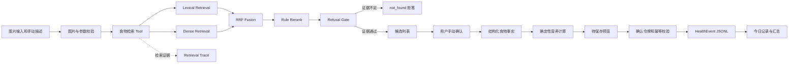

# 食物健康助手 Agent

一个面向 AI 应用工程学习和求职作品集的个人健康管理助手。

当前版本完成了“图片输入入口 → 手动食物描述 → Hybrid RAG 检索 → 用户确认 → 确定性营养计算 → HealthEvent 保存 → 今日汇总”的纵向链路。

项目重点不是生成医疗建议，而是展示一套可运行、可解释、可评测、可拒答、可追溯的 Agent/RAG 工程实现。

> 项目需求参考：[个人健康管理助理 Agent PRD](https://ruiyuan-ai-career-map.vercel.app/food-health-assistant-prd.html)

## 项目状态

当前处于 P0 饮食记录与 Hybrid RAG 阶段。

| 能力 | 状态 | 说明 |
| --- | --- | --- |
| 单张食物图片输入 | 已完成 | 图片仅作为输入入口，暂不进行视觉识别 |
| 手动填写食物名称 | 已完成 | 支持标准名、别名和自然语言描述 |
| 食物 Hybrid RAG | 已完成 | Lexical + Dense + RRF + Rule Rerank |
| 语义提示文档 | 已完成 | 使用人工提示增强描述性查询 |
| 检索拒答门控 | 已完成 | 拒绝低置信度、歧义和领域外查询 |
| 用户确认候选 | 已完成 | 系统不会直接把检索第一名当作最终事实 |
| 确定性营养计算 | 已完成 | 不允许大模型生成营养数值 |
| meal HealthEvent 保存 | 已完成 | JSONL 存储、确认令牌和幂等保护 |
| 今日记录与汇总 | 已完成 | 保存后重新读取本地事件文件 |
| 检索 Trace | 已完成 | 保存查询、候选、策略、数据集和耗时 |
| 单元测试 | 已完成 | 覆盖检索、门控、存储和计算 |
| 核心链路 E2E | 已完成 | 无浏览器、无 API Key 的纵向链路测试 |
| RAG 离线评测 | 已完成 | 支持 lexical 和 hybrid 两种模式 |
| 图片食物识别 | 未实现 | 尚未接入 YOLO 或视觉模型 |
| LLM Agent Loop | 未实现 | 尚无 model_rounds、tool_steps 和 state |
| 四类 HealthEvent CRUD | 部分完成 | 当前主要实现 meal 的创建、读取和汇总 |
| GitHub Actions CI | 未实现 | 最终验收前需要补充 |
| P1 目标、记忆和 check-in | 未实现 | 属于后续阶段 |

## 核心设计原则

### 1. RAG 负责找食物，不负责生成营养事实

Hybrid RAG 只负责从固定食物数据库中检索候选。

热量、蛋白质、脂肪和碳水等数值必须来自结构化食物数据，不能由 Embedding 模型或大模型生成。

### 2. 用户必须确认食物候选

即使检索结果置信度较高，当前版本也不会自动保存第一名。

用户必须从候选列表中明确选择食物，再进入营养计算。

### 3. 营养计算必须确定性执行

计算公式固定为：

```text
每 100g 营养值 × 用户填写克重 ÷ 100
```

同一食物、同一份量和同一数据版本必须得到相同结果。

### 4. 证据不足时拒答

向量检索永远可以返回一个“最相似结果”，但最相似不代表正确。

项目在 Hybrid Retrieval 后增加了拒答门控：

- 标准名精确匹配：放行；
- 人工别名精确匹配：放行；
- 词法与 Dense 共同命中：放行；
- 查询类别与候选类别一致且 Dense 分数达标：放行；
- Dense 分数过低：拒答；
- 第一名和竞争候选过于接近：拒答；
- 查询缺少饮食领域信号：拒答；
- 没有候选：拒答。

拒答结果使用：

```text
status = not_found
candidates = []
auto_select_allowed = false
```

系统不会使用被拒答的候选计算营养数据。

## 系统架构



## Hybrid RAG 检索流程

一次 Hybrid 检索依次执行：

```text
用户查询
→ 文本归一化
→ 四阶段词法召回
→ Dense 向量召回
→ RRF 排名融合
→ 类别约束与规则重排
→ 弱单字包含过滤
→ 拒答门控
→ 用户确认候选
→ 根据 food_id 读取结构化营养事实
```

### 词法召回

词法召回包含四个阶段：

1. 标准名称完全匹配；
2. 人工别名完全匹配；
3. 双向包含匹配；
4. 字符级模糊匹配。

### Dense Retrieval

Dense Retrieval 使用：

```text
BAAI/bge-small-zh-v1.5
```

食物记录会转换成语义检索文档，内容包括：

- 标准名称；
- 别名；
- 食物类别；
- 人工语义提示。

文档向量保存在本地 NumPy 索引中。

### RRF Fusion

项目使用 Reciprocal Rank Fusion 融合词法排名和 Dense 排名。

RRF 主要依赖两个检索通道中的排名，不直接混合两套量纲不同的原始分数。

### Rule Rerank

融合后继续执行确定性规则：

- 标准名和别名精确匹配优先；
- 查询明确提到类别时，同类别候选优先；
- 单字食物名不能因为出现在长描述中形成强包含命中。

例如：

```text
橙色的根茎类蔬菜
```

不能因为“橙色”中包含“橙”，就把水果“橙”排在胡萝卜前面。

## 技术栈

- Python 3.11+
- Gradio
- Pydantic v2
- Pillow
- NumPy
- Sentence Transformers
- BAAI/bge-small-zh-v1.5
- pytest
- JSON Lines

所有 Python 直接依赖均在 `requirements.txt` 中固定版本。

项目不需要任何大模型 API Key。

第一次构建索引或第一次运行 Dense Retrieval 时，Sentence Transformers 可能需要从模型仓库下载 BGE 模型。模型已经缓存后，可以继续在本地使用。

## 目录结构

```text
health-assistant-agent/
├── app.py
├── requirements.txt
├── .env.example
├── README.md
├── LICENSE
├── data/
│   ├── aliases.json
│   ├── retrieval_hints.json
│   ├── samples/
│   │   └── foods_sample.json
│   └── index/
│       ├── food_documents.json
│       ├── food_embeddings.npy
│       └── index_manifest.json
├── docs/
│   ├── DATA_SOURCES.md
│   ├── DECISIONS.md
│   ├── EVALUATION.md
│   ├── RAG.md
│   ├── eval_lexical.json
│   └── eval_hybrid.json
├── scripts/
│   ├── prepare_food_data.py
│   ├── build_food_index.py
│   └── run_eval.py
├── src/
│   ├── health/
│   ├── nutrition/
│   │   ├── calculator.py
│   │   ├── repository.py
│   │   ├── retrieval_document.py
│   │   ├── dense_retriever.py
│   │   ├── hybrid_retriever.py
│   │   ├── retrieval_gate.py
│   │   ├── retrieval_trace.py
│   │   ├── evaluation.py
│   │   └── text_normalize.py
│   ├── storage/
│   ├── tools/
│   └── ui/
└── tests/
    ├── e2e/
    ├── eval/
    ├── fixtures/
    └── unit/
```

## 十分钟快速启动

### 1. 创建 Python 3.11 虚拟环境

进入项目根目录：

```bash
cd health-assistant-agent
```

创建虚拟环境：

```bash
python3.11 -m venv .venv
```

激活虚拟环境：

```bash
source .venv/bin/activate
```

确认当前解释器：

```bash
python --version
```

预期为 Python 3.11 或更高版本。

### 2. 安装依赖

```bash
python -m ensurepip --upgrade
python -m pip install --upgrade pip
python -m pip install -r requirements.txt
```

请始终使用：

```bash
python -m pip
```

不要混用系统环境中的裸 `pip`。

### 3. 使用 Lexical 模式快速启动

Lexical 模式不需要下载 Embedding 模型：

```bash
export RAG_MODE=lexical
python app.py
```

浏览器访问：

```text
http://127.0.0.1:7860
```

### 4. 使用 Hybrid RAG 模式启动

如果仓库中不存在可用的 `data/index`，先构建索引：

```bash
python scripts/build_food_index.py \
  --data data/samples/foods_sample.json \
  --hints data/retrieval_hints.json \
  --index-dir data/index
```

然后启动 Hybrid 模式：

```bash
export RAG_MODE=hybrid
python app.py
```

第一次运行可能需要下载：

```text
BAAI/bge-small-zh-v1.5
```

下载时间取决于网络环境，不计入纯本地代码启动时间。

## 使用流程

1. 打开“记录饮食”页面。
2. 上传一张 JPG、JPEG 或 PNG 图片。
3. 手动填写食物名称或食物描述。
4. 填写可食部分克重。
5. 点击“查找候选”。
6. 检查候选、类别、匹配类型、分数和来源。
7. 从候选列表中手动选择食物。
8. 点击“计算营养估算”。
9. 检查食物、份量、营养值、来源和假设。
10. 明确确认后保存。
11. 在“今日记录”中查看重新读取的记录和汇总。

图片目前仅作为输入入口，不执行图片识别，也不会复制到项目数据目录。

## 手动验证 Hybrid RAG

### 标准名称

查询：

```text
番茄
```

预期第一名：

```text
番茄
```

门控策略应包含：

```text
refusal_gate:pass:exact_lexical
```

### 人工别名

查询：

```text
西红柿
```

预期召回：

```text
番茄
```

### 描述性查询

查询：

```text
橙色的根茎类蔬菜
```

预期第一名：

```text
胡萝卜
```

### 领域外拒答

查询：

```text
蓝色跑车
```

预期：

```text
status = not_found
candidates = []
```

### 低置信度拒答

查询：

```text
一种没有具体描述的食物
```

如果检索证据不足，系统应拒绝返回候选，不得猜测营养数值。

## 运行自动化测试

### 单元测试

```bash
python -m pytest -q tests/unit
```

### 固定检索评测测试

```bash
python -m pytest -q tests/eval
```

### 核心链路 E2E

```bash
python -m pytest -q tests/e2e
```

当前 E2E 不启动真实浏览器，主要覆盖：

- 固定测试图片校验；
- 食物别名检索；
- 确定性营养计算；
- HealthEvent 构建；
- 确认令牌；
- 幂等保存；
- JSONL 重新读取；
- `not_found` 不产生营养估算；
- 未确认时拒绝保存。

## 运行 RAG 评测

### Lexical 基线

```bash
python scripts/run_eval.py \
  --mode lexical \
  --data data/samples/foods_sample.json \
  --report docs/eval_lexical.json
```

### Hybrid RAG

确保 `data/index` 已成功构建，然后执行：

```bash
python scripts/run_eval.py \
  --mode hybrid \
  --data data/samples/foods_sample.json \
  --index-dir data/index \
  --report docs/eval_hybrid.json
```

### 验收门槛

| 指标 | 门槛 |
| --- | ---: |
| Recall@3 | 大于或等于 0.85 |
| Rejection Accuracy | 等于 1.0 |
| Dense 降级次数 | 等于 0 |
| 报告 `passed` | `true` |

评测集固定包含 20 条查询，覆盖：

- 标准名称；
- 人工别名；
- 口语名称；
- 复合菜；
- 相似食物区分；
- 错别字；
- 明确拒答。

评测报告是最终指标的事实来源。修改检索规则、语义提示、模型或索引后，必须重新生成报告，不能继续使用旧报告。

## 数据与索引可复现性

向量索引包含：

```text
food_documents.json
food_embeddings.npy
index_manifest.json
```

索引清单记录：

- 数据集 ID；
- 数据集 SHA-256；
- 模型名称；
- 模型 revision；
- 查询指令；
- 文档数量；
- Embedding 维度；
- 文档文件 SHA-256；
- 向量文件 SHA-256。

运行时会检查索引和当前数据集是否匹配。

如果食物数据或语义提示发生改变，必须重新运行：

```bash
python scripts/build_food_index.py \
  --data data/samples/foods_sample.json \
  --hints data/retrieval_hints.json \
  --index-dir data/index
```

## Dense Retrieval 降级策略

以下情况会使 Dense Retrieval 降级：

- 找不到索引清单；
- 数据集哈希不匹配；
- 文档或向量文件缺失；
- 文件哈希不匹配；
- 向量维度不匹配；
- 模型无法加载。

Dense 不可用时，系统回退到词法检索，但回退结果仍然必须经过拒答门控。

系统会在 `strategies_used` 中记录：

```text
dense_unavailable:<ERROR_CODE>
```

## 数据来源与限制

公开仓库只包含：

```text
data/samples/foods_sample.json
```

该文件包含 28 条手写示例占位数据，仅用于学习、测试和演示。

数据来源字段标记为：

```text
《中国食物成分表》第 6 版整理仓库（示例占位，仅供学习）
```

它不是《中国食物成分表》的完整数据集，不能作为生产环境营养数据库。

完整上游数据不得提交到公开仓库。

取得合法的本地数据后，可以执行：

```bash
python scripts/prepare_food_data.py \
  --src <上游 JSON 目录> \
  --out data/full/foods_normalized.json \
  --aliases data/aliases.json \
  --report data/full/prepare_report.json
```

应用按以下优先级选择食物数据：

1. `FOOD_DATA_PATH` 指定的文件；
2. 本地 `data/full/foods_normalized.json`；
3. 公开示例 `data/samples/foods_sample.json`。

## 数据存储与隐私

确认后的健康事件保存在：

```text
data/health_events.jsonl
```

检索 Trace 保存在：

```text
data/traces.jsonl
```

以下内容不得提交到 GitHub：

- `.env`；
- 用户健康记录；
- 检索 Trace；
- 用户上传图片；
- 完整食物数据；
- 私有原始数据；
- 临时备份目录。

图片目前只用于输入校验，不会由应用复制到项目数据目录。

## 健康安全边界

本项目只用于：

- AI 应用工程学习；
- RAG 检索实验；
- 软件工程作品集展示；
- 饮食记录流程演示。

本项目不提供：

- 医疗诊断；
- 疾病判断；
- 个体化处方；
- 用药建议；
- 治疗建议；
- 疗效保证；
- 紧急医疗服务。

页面展示的营养结果是基于固定食物数据和用户填写克重计算的估算值，仅供学习参考。

如涉及疾病、过敏、孕期、儿童、老年人、用药、进食障碍或其他高风险情况，应咨询医生、注册营养师或其他合格专业人员。

## Trace 与可解释性

每次检索 Trace 包含：

- `trace_id`；
- 创建时间；
- 原始查询；
- 归一化查询；
- 检索状态；
- Top-K 候选；
- 词法排名；
- Dense 排名；
- Dense 相似度；
- RRF 分数；
- 使用的检索策略；
- 数据集 ID；
- 数据记录数量；
- 检索耗时。

当前版本尚未接入 LLM Agent，因此还没有：

- `model_rounds`；
- `tool_steps`；
- Agent `state`；
- 多轮模型轨迹。

## GitHub 最终验收清单

根据项目 PRD 的 GitHub 交付要求，提交前逐项检查：

- [x] Python 3.11+ 和固定依赖；
- [x] `python app.py` 唯一应用入口；
- [x] 无大模型 API Key 也能启动；
- [x] 公开示例数据；
- [x] 数据来源和版权边界；
- [x] Hybrid RAG 实现；
- [x] RAG 固定评测脚本；
- [x] Recall@3 门槛；
- [x] 拒答准确率门槛；
- [x] 检索 Trace；
- [x] 核心纵向链路 E2E；
- [x] 架构说明；
- [x] 健康安全说明；
- [x] 隐私与 Git 忽略规则；
- [ ] 重新生成并确认最终 Hybrid 评测报告；
- [ ] GitHub Actions CI；
- [ ] 浏览器级 E2E；
- [ ] 四类 HealthEvent 的完整 CRUD；
- [ ] `model_rounds`、`tool_steps` 和 Agent `state`；
- [ ] P1 目标、记忆、check-in 和周期报告。

未完成项必须如实保留，不能为了展示效果标记为已完成。

## 已知限制

- 图片暂不进行食物识别；
- 当前食物库只有 28 条示例数据；
- 自然语言描述的效果依赖语义提示覆盖范围；
- Dense 模型第一次运行需要下载；
- 本地 JSONL 存储只适合单进程学习项目；
- 没有用户登录和权限隔离；
- 没有云端数据库；
- 没有完整 Agent Loop；
- 没有医疗审核能力。

## License

本项目使用 MIT License。

第三方数据和模型仍受各自许可证、使用条款及版权要求约束。