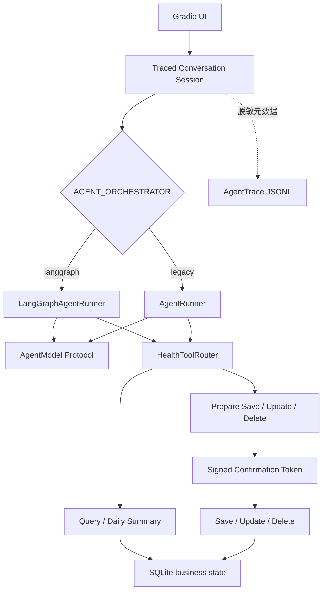
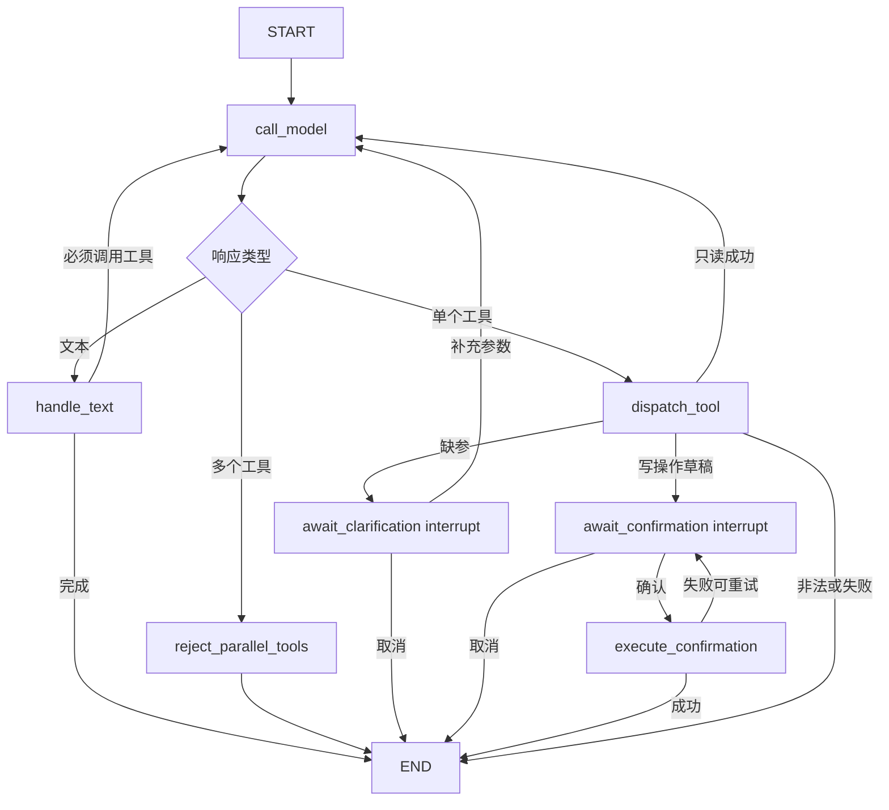

# 系统架构

## 目标与边界

本项目是单用户、本地运行的健康记录助理。LangGraph 负责 Agent 编排，不负责
生成营养数值，也不替代领域工具、确认协议或持久化存储。

业务事实边界：

- 本地业务数据库：`data/healthos.db`；
- HealthEvent：SQLite `health_events` 表；
- Agent Trace：`data/agent_traces.jsonl`；
- 营养检索 Trace：`data/traces.jsonl`；
- LangGraph checkpoint：P0 使用进程内 `InMemorySaver`，只保存短期会话状态；
- 图片默认不长期保存；
- HealthOS P1 档案、目标版本和提醒：SQLite 分表保存；
- 对话会话：SQLite `conversation_sessions` 表，浏览器刷新或进程重启后可恢复；
- 模型不能直接执行保存、修改或删除。

## 分层结构



## 本地网页形态与存储决策

产品保持为本地运行的 Gradio 网页，而不是新增原生桌面 App。浏览器只是交互层，
模型、工具、SQLite 和 RAG 均运行在用户本机。这样既保留本地数据边界，也避免为
Windows、macOS 和 Linux 分别维护客户端外壳；未来如果需要远程部署，UI 和领域层
也无需重写。

| 维度 | JSON / JSONL | SQLite | 当前用途 |
| --- | --- | --- | --- |
| 追加日志 | 简单、可直接检查 | 可以，但不如行日志直观 | JSONL 保存脱敏 Agent/RAG Trace |
| 查询与更新 | 需要扫描或重写文件 | 索引查询、事务更新 | SQLite 保存业务状态 |
| 多实体一致性 | 很难跨文件保证 | 单事务提交或回滚 | 档案、目标、提醒、幂等结果 |
| 会话恢复 | 多个小文件 | 单表查询和原子更新 | SQLite 保存会话快照 |
| 人工导出 | 原生可读 | 需要导出命令 | JSONL 作为交换/验收格式 |

### 分层状态模型

| 状态层 | 内容 | 是否持久化 | 明确不保存 |
| --- | --- | --- | --- |
| 用户档案 | 时区、单位、教练风格、用户确认的偏好与忌口 | SQLite `user_profiles` | 疾病、心理状态等模型推断 |
| 健康目标 | 目标类型、数值、周期、原因和不可变版本历史 | SQLite `health_goals` | 自动覆盖的旧版本 |
| 健康事实 | 已确认的饮食、饮水、体重、运动事件与来源 | SQLite `health_events` | 未确认草稿和模型猜测 |
| 会话状态 | 用户/助手可见消息、待补参、待确认任务 | SQLite `conversation_sessions` | 隐藏思维链和 Provider 内部状态 |
| 知识记忆 | 固定知识源、食物数据与可重建 RAG 索引 | 源数据/索引文件 | 单次检索长文本、模型生成结论 |
| 提醒 | 时间、时区、内容、状态和转换历史 | SQLite `reminders` | 未确认提醒草稿 |
| 审计轨迹 | 脱敏工具名、状态、错误码和耗时 | JSONL | 健康参数值、令牌、原始对话 |

### 迁移、验证与回滚

首次启动空 SQLite 数据库时会执行幂等的非破坏迁移，也可以手动运行：

```bash
.venv/bin/python scripts/migrate_storage.py
.venv/bin/python scripts/migrate_storage.py --verify-only
```

迁移按源文件 SHA-256 去重，在一个 SQLite 事务中完成，失败会整体回滚。验收至少
检查 `PRAGMA integrity_check = ok` 和各实体记录数。旧 `health_events.jsonl`、
`healthos_state.json` 和会话目录不会被删除；需要回退时设置
`STORAGE_BACKEND=json` 并重启应用。SQLite 已产生的新记录不会自动反向同步到旧
文件，因此回滚主要用于迁移验收期，而不是长期双写方案。

## 五层 Prompt Context Pipeline

每次模型调用统一按以下优先级装配上下文：

```text
1. System Rules：安全、工具白名单、确认和事实边界
2. User Input：本轮输入，作为独立 user message
3. User Profile：最小且经过用户确认的档案
4. Goals & Pending Task：活动目标和本轮待补充任务
5. Verified Context：已执行工具结果与用户已确认事实
```

工具结果优先于模型记忆，用户最新确认优先于旧会话。界面只展示层级来源、意图、
实际工具、数据来源、当前状态和下一步，不展示隐藏思维链、确认令牌或原始内部 JSON。

## LangGraph 节点



## 图状态

checkpoint 中只保存编排需要的数据：

- `session_id`、`user_id`、`timezone_name`；
- 标准化消息；
- `agent_state`、`finish_reason`、`model_rounds`；
- 脱敏展示使用的 `tool_steps`；
- `pending_task`；
- `pending_confirmation`；
- 当前模型响应和下一跳。

P0 的 checkpoint 位于内存中，避免把完整短期对话和健康工具结果额外持久化。
如果以后改为 SQLite/Postgres checkpointer，必须先补充保留期限、清除、加密和
敏感字段审查。

## 缺参流程

```text
用户：我跑步了
→ 模型调用 prepare_health_event(activity_type=跑步)
→ Router 返回 needs_clarification(duration_minutes)
→ 图停在 await_clarification
→ UI 展示“持续了多少分钟”
→ 用户：30分钟
→ Command(resume={action: clarify, text: 30分钟})
→ 模型重新调用工具，已知参数与新参数合并
→ 生成草稿
→ 图停在 await_confirmation
```

取消缺参任务会清除 pending task，不写 HealthEvent。

## 写操作确认流程

```text
模型提出 prepare_* 工具调用
→ Router 校验参数
→ 确定性代码生成草稿、确认令牌和幂等键
→ checkpoint 保存草稿
→ await_confirmation interrupt
→ 用户确认
→ Command(resume={action: confirm})
→ execute_confirmation 调用真正写工具
→ 工具再次校验确认令牌和幂等键
→ 写入成功后状态才变为 completed
```

草稿生成和 interrupt 位于不同节点，避免恢复 interrupt 时重复生成令牌。真正的
写工具位于 interrupt 之后；即使执行节点重试，幂等键也阻止重复副作用。

## 失败与回滚

- 未知工具：Router 拒绝，图进入 `failed`，不写事件；
- 参数非法：Pydantic 校验失败，不写事件；
- 缺参：图暂停，不产生半成品 HealthEvent；
- 用户取消：清除 pending 状态，不写或修改事件；
- 写入失败：保留待确认草稿并再次暂停，允许安全重试或取消；
- Trace 写入失败：向开发者证据区返回警告，不回滚已经成功的 HealthEvent；
- 达到模型轮次上限：终止为 `loop_limit`，不把模型文本当作工具成功。

## Legacy 回退

```dotenv
AGENT_ORCHESTRATOR=legacy
```

该配置切回原有 `AgentRunner`。两种实现共享模型协议、HealthToolRouter、领域工具、
SQLite Store 和 JSONL Trace，因此切换编排器不会迁移或改变已保存健康事件。

## HealthOS P1 工具与状态

Router 对模型只公开 PRD 规定的 15 个工具：档案 2 个、目标 2 个、健康事实 3 个、
营养 2 个、知识 1 个、汇总 2 个和提醒 3 个。P0 的旧工具名称只在内部保留为
兼容别名，不再出现在 Provider Tool Schema 中。

档案、目标和提醒使用同一个确认中间件：

```text
prepare_* / create_* / list_or_cancel_*(写意图)
→ 严格 Schema 与领域校验
→ 返回无副作用草稿 + 短时签名令牌 + 幂等键
→ 用户确认
→ Router.confirm
→ 再次验证 action、user、payload 摘要与幂等键
→ 在 SQLite 事务中提交
```

目标保存不可变版本数组；提醒保存每次状态转换；档案只保存明确允许的最小字段。
模型推断的疾病、心理状态和原始敏感 Prompt 不进入长期状态。周期汇总只从 committed
HealthEvent 计算，不把缺失日期补成事实，也不解释变化原因。
