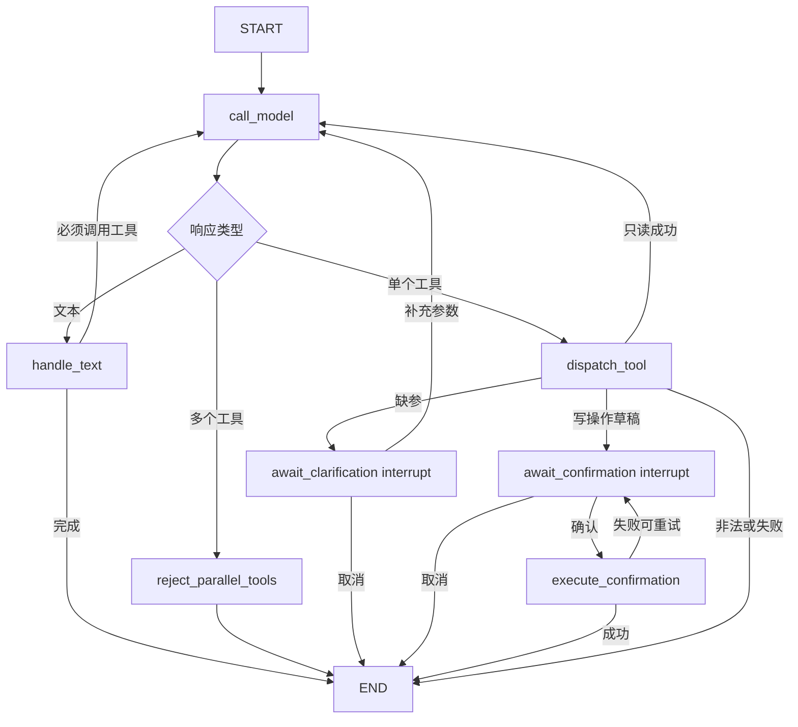

# 系统架构

## 目标与边界

本项目是单用户、本地运行的健康记录助理。LangGraph 负责 Agent 编排，不负责
生成营养数值，也不替代领域工具、确认协议或持久化存储。

业务事实边界：

- HealthEvent：`data/health_events.jsonl`；
- Agent Trace：`data/agent_traces.jsonl`；
- 营养检索 Trace：`data/traces.jsonl`；
- LangGraph checkpoint：P0 使用进程内 `InMemorySaver`，只保存短期会话状态；
- 图片默认不长期保存；
- 模型不能直接执行保存、修改或删除。

## 分层结构


## LangGraph 节点



## 图状态

checkpoint 中只保存编排需要的数据：

- `session_id`、`user_id`、`timezone_name`；
- 标准化消息；
- `agent_state`、`finish_reason`、`model_rounds`；
- 脱敏展示使用的 `tool_steps`；
- `pending_task`；
- `pending_confirmation`；
- 当前模型响应和下一跳。

P0 的 checkpoint 位于内存中，避免把完整短期对话和健康工具结果额外持久化。
如果以后改为 SQLite/Postgres checkpointer，必须先补充保留期限、清除、加密和
敏感字段审查。

## 缺参流程

```text
用户：我跑步了
→ 模型调用 prepare_health_event(activity_type=跑步)
→ Router 返回 needs_clarification(duration_minutes)
→ 图停在 await_clarification
→ UI 展示“持续了多少分钟”
→ 用户：30分钟
→ Command(resume={action: clarify, text: 30分钟})
→ 模型重新调用工具，已知参数与新参数合并
→ 生成草稿
→ 图停在 await_confirmation
```

取消缺参任务会清除 pending task，不写 HealthEvent。

## 写操作确认流程

```text
模型提出 prepare_* 工具调用
→ Router 校验参数
→ 确定性代码生成草稿、确认令牌和幂等键
→ checkpoint 保存草稿
→ await_confirmation interrupt
→ 用户确认
→ Command(resume={action: confirm})
→ execute_confirmation 调用真正写工具
→ 工具再次校验确认令牌和幂等键
→ 写入成功后状态才变为 completed
```

草稿生成和 interrupt 位于不同节点，避免恢复 interrupt 时重复生成令牌。真正的
写工具位于 interrupt 之后；即使执行节点重试，幂等键也阻止重复副作用。

## 失败与回滚

- 未知工具：Router 拒绝，图进入 `failed`，不写事件；
- 参数非法：Pydantic 校验失败，不写事件；
- 缺参：图暂停，不产生半成品 HealthEvent；
- 用户取消：清除 pending 状态，不写或修改事件；
- 写入失败：保留待确认草稿并再次暂停，允许安全重试或取消；
- Trace 写入失败：向开发者证据区返回警告，不回滚已经成功的 HealthEvent；
- 达到模型轮次上限：终止为 `loop_limit`，不把模型文本当作工具成功。

## Legacy 回退

```dotenv
AGENT_ORCHESTRATOR=legacy
```

该配置切回原有 `AgentRunner`。两种实现共享模型协议、HealthToolRouter、领域工具、
JSONL Store 和 Trace，因此回退不会迁移或改变已保存健康事件。
